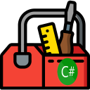

#  CSharpToolbox

Not the greatest name for a project, but it does what it claims to do:
It's a set of little helper functions and life-easier-makers that I found myself copy-pasting into multiple projects.
 
And then I decided to put them into a little repo to re-use and add to whenever I come up with something new.

Icon made up of work from [smashicons.com](https://smashicons.com/) & [flaticon.com](https://www.flaticon.com/) and the [dotnet repo](https://github.com/dotnet/docs/blob/cb475ed45f881e9462e34764480d3b0ebce85e91/docs/images/hub/csharp.svg)